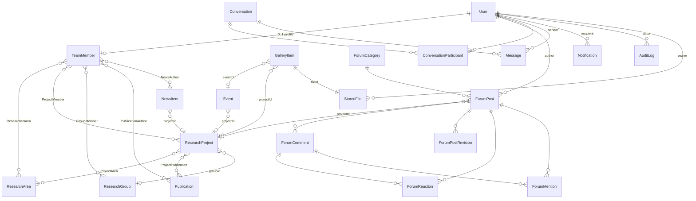

# Platform architecture & database foundation (Phase 8)

Status: schema + migration applied, visibility enforcement and account audit live.
No new UI, no new endpoints. Phases 1–7 behaviour is unchanged (see "Verification").

> **Update (Phase 9):** §4 (permissions), §5 (visibility) and §11 (audit) are now implemented — see
> `phase9-authorization-and-research-platform.md`, which also lists the few places where Phase 9 interpreted
> or deviated from this document. Nothing else in this document has changed.

This is the design record behind `apps/server/prisma/schema.prisma` and the
`20260920131500_phase8_foundation` migration. Read it before starting a feature phase.

---

## 1. Current architecture (as audited)

```
React 19 + Vite (apps/web)  ──/api──▶  Express 4 (apps/server)  ──▶  Prisma 5.22  ──▶  SQLite (dev.db)
        │                                   │
        └── @scl/shared (Zod schemas, types; consumed as TS source by both) ◀──┘
```

- **Monorepo** (npm workspaces): `apps/web`, `apps/server`, `packages/shared`.
- **Auth**: `express-session`, cookie `scl.sid` (HttpOnly, SameSite=Lax, 7-day rolling),
  session rows stored in the `Session` table by a small custom `PrismaSessionStore`.
  Login regenerates the session id. `getSessionUser` re-reads the user from the database on every
  request, so role changes and account deletion take effect immediately.
- **Authorization** (`middleware/auth.ts`): `requireAuth`, `requireAdmin`, `requireOwnerOrAdmin(param)`
  (owner = the account linked to the team member in the URL), plus the link rule in
  `lib/authorLinks.ts` (a member may only add/remove *themselves* as an author).
  Roles are the strings `ADMIN | MEMBER` (Zod enum in `packages/shared`).
- **Validation**: every write goes through a Zod schema in `packages/shared` via `parseOrThrow`;
  ids are checked against `ID_PATTERN` before reaching the database.
- **Errors**: `HttpError`/`ValidationError` plus a central handler that also maps Prisma
  `P2025/P2003/P2002` to 404/400/409.
- **Frontend**: React Router v6, `AuthContext` (user via `/auth/me`), `ProtectedRoute` (UX-only gate),
  thin `apiFetch`, `useApiResource`. One hand-written stylesheet (`index.css`, CSS variables ported
  from the reference). Pages: Home, Research, Team, Member, Publications, News, Contact, Login,
  Profile, Schedule (a Google Calendar iframe — no backend), Admin (accounts).
- **Reference site** (`Lab-Website/reference`) is untouched.

### Existing data model (before Phase 8)

| Table | Purpose | Notes |
|---|---|---|
| `User` | login account | `role` string, unique lowercase `email`, bcrypt hash |
| `TeamMember` | the **researcher/profile** shown on the site | `userId` nullable+unique → 0..1 account; alumni have none |
| `HistoryEntry` | a member's timeline | cascade on member delete |
| `Publication`, `PublicationAuthor` | papers + M:N link to `TeamMember` | free-text `authors` *and* real links |
| `NewsItem`, `NewsAuthor` | news + M:N link to `TeamMember` | `dateLabel` (display) + `sortDate` (ISO) |
| `ResearchArea` | broad research theme | **not** a project |
| `Session` | express-session store | |

Observations that shaped the design: no visibility concept (all read routes were public);
`TeamMember` already *is* the researcher entity, so no separate `Researcher`/`Profile` table is
introduced; all "enums" are strings validated only in Zod; there is no audit trail; every logged-in
user may create/edit publications, news and research areas (reference behaviour) and only admins
delete.

---

## 2. Future domain model

Two rules decide what is a table and what is not:

1. **No duplicate concepts.** `Researcher` = `TeamMember`; `Profile` = `TeamMember`;
   `Account` = `User`. `Role/Permission` is *not* a table (see §4). `Attachment` is not a table:
   file metadata carries its own association (§7).
2. **FK integrity wherever the parent is known; polymorphic `(entityType, entityId)` only for the
   three genuinely cross-cutting tables** (`Notification`, `AuditLog`, `Translation`) and for
   `StoredFile` attachments.

### Entity map



### Every table, and why it exists

| Table | New? | Requirement it serves | Key decisions |
|---|---|---|---|
| `User`, `TeamMember`, `HistoryEntry` | existing | accounts, researcher profiles | unchanged (only back-relations added) |
| `Publication`, `NewsItem`, `ResearchArea` | existing, **+`visibility`** | public/internal content | `DEFAULT 'PUBLIC'` keeps every existing row exactly as visible as before; `NewsItem` also gets optional `projectId` |
| `ResearchProject` | new | projects | `slug` unique; `status` = research lifecycle (PLANNED/ACTIVE/COMPLETED/ARCHIVED), *not* publish state; `groupId` N:1; default `LAB_ONLY` |
| `ResearchGroup`, `GroupMember` | new | lab groups | leader = `GroupMember.role='LEAD'` (no separate leader column) |
| `ProjectMember` | new | researcher↔project | carries `role` (LEAD/MEMBER/COLLABORATOR) |
| `ProjectArea`, `ResearcherArea` | new | project↔area, researcher↔area | pure M:N joins |
| `ProjectPublication` | new | project↔publication | M:N: joint projects genuinely share papers |
| `Event` | new | events / DB-driven schedule | N:1 project; the Google-Calendar `/schedule` stays until an events phase replaces it |
| `StoredFile` | new | uploads | metadata only; see §7 |
| `GalleryItem` | new | gallery | wraps a `StoredFile`; **no visibility of its own** (file is the single source of truth) |
| `ForumCategory`, `ForumPost`, `ForumComment` | new | forum | visibility lives on the **category** only (§5, §9) |
| `ForumReaction`, `ForumMention` | new | reactions, mentions | typed FKs to post *or* comment, XOR enforced by a DB `CHECK` |
| `ForumPostRevision` | new | edit history | snapshot of the *previous* title+body on each post edit; comments keep only `editedAt` |
| `Conversation`, `ConversationParticipant`, `Message` | new | private messaging | §8 |
| `Notification` | new | notifications | §10 |
| `AuditLog` | new | activity/audit | §11 |
| `Translation` | new | ja/en | §6 |

**Relationships deliberately *not* many-to-many** (a foreign key is enough): news→project,
event→project, forum post→project, project→group, gallery→event/project. Only relationships that
are truly M:N got a join table: project↔area, project↔researcher, project↔publication,
researcher↔area, group↔researcher (plus the two that already existed).

**Not created** (and why): `Profile`, `Researcher`, `Role`, `Permission` (duplicates / code, not
data); `Attachment` (association lives on `StoredFile`); `ForumReport` (a moderation queue is an
additive table if the lab ever needs it — admins can hide/lock/delete today); `MessageAttachment`
(a `StoredFile` with `entityType='MESSAGE'`).

**Conventions**: cuid ids; `createdAt/updatedAt`; string "enums" with Zod as the authority; curated
content is hard-deleted (as today), conversational content is soft-deleted (`status`/`deletedAt`);
deleting a `User` never deletes shared content (author/actor/owner columns are nullable →
`SetNull`), but purely personal rows cascade (notifications, reactions, conversation membership).
Every **new** table defaults to `LAB_ONLY` (fail closed); every **pre-existing** table defaults to
`PUBLIC` (it already was).

---

## 3. Existing-table changes actually applied

Exactly four `ALTER TABLE … ADD COLUMN`, all in place (no table rebuild):

```sql
ALTER TABLE "Publication"  ADD COLUMN "visibility" TEXT NOT NULL DEFAULT 'PUBLIC';
ALTER TABLE "ResearchArea" ADD COLUMN "visibility" TEXT NOT NULL DEFAULT 'PUBLIC';
ALTER TABLE "NewsItem"     ADD COLUMN "visibility" TEXT NOT NULL DEFAULT 'PUBLIC';
ALTER TABLE "NewsItem"     ADD COLUMN "projectId"  TEXT REFERENCES "ResearchProject"("id") ON DELETE SET NULL ON UPDATE CASCADE;
```

`TeamMember` and `User` were **not** altered. Enhanced-profile columns (ORCID, website, interests…)
belong to the profile phase; they are nullable `ADD COLUMN`s and cost nothing to add later.

---

## 4. Permission model

Roles are **data** (`User.role`, already a free string, so no migration is needed to add one).
What each role may do is **code**, in one place, enforced on the server.

| Capability | Guest | MEMBER | LAB_MANAGER *(future)* | ADMIN |
|---|---|---|---|---|
| Read `PUBLIC` content | ✔ | ✔ | ✔ | ✔ |
| Read `LAB_ONLY` content, forum, schedule | ✘ | ✔ | ✔ | ✔ |
| Edit own profile + history; link/unlink *self* as author | – | ✔ | ✔ | ✔ |
| Create publications / news / research areas *(reference behaviour)* | ✘ | ✔ | ✔ | ✔ |
| Edit any publication / news item / research area *(reference behaviour: any logged-in user; keep)* | ✘ | ✔ | ✔ | ✔ |
| Set `visibility` on content (publish/unpublish to the public) | ✘ | ✘ | ✔ | ✔ |
| Create/edit projects, groups, events, gallery, categories | ✘ | own only (project lead / event creator) | ✔ | ✔ |
| Hard-delete curated content | ✘ | ✘ | ✔ | ✔ |
| Forum: post, comment, react, edit/delete **own** | ✘ | ✔ | ✔ | ✔ |
| Forum moderation: hide, lock, pin, move, delete anyone's | ✘ | ✘ | ✔ | ✔ |
| Send/read **own** messages | ✘ | ✔ | ✔ | ✔ |
| Read **other people's** messages | ✘ | ✘ | ✘ | **✘ (by design)** |
| Upload files; read files they may see | ✘ | ✔ | ✔ | ✔ |
| Create/delete accounts, change roles | ✘ | ✘ | ✘ | ✔ |
| Read the audit log | ✘ | ✘ | ✔ (read-only) | ✔ |

Admins cannot read private messages through the API. That is a deliberate privacy boundary, not an
oversight; a lab that needs message moderation must decide that explicitly and audit it.

### Enforcement rules (so nothing depends on hidden buttons)

1. **Route guard** first (`requireAuth` / `requireRole(...)`), then a **resource policy** — a pure
   function `can(user, action, resource)` in `apps/server/src/lib/policy` (Phase 9) — never inline
   `role === "ADMIN"` checks. Today there are ~16 such inline checks on the server
   (`auth.ts`, `authorLinks.ts`, `team|news|publications|research|users.routes.ts`) and ~12 in the
   web app; introducing `LAB_MANAGER` means replacing those with policy calls in one focused change.
2. **Reads are filtered by the query**, not by the handler after the fact: every list composes
   `visibleTo(viewer)`; every by-id read is `findFirst({ id, ...visibleTo(viewer) })`. A hidden row
   answers **404**, identical to a missing one (no existence oracle).
3. **Private data is scoped by membership in the query**: messages are only ever read through
   `conversation.participants.some({ userId: me })`. There is no "get message by id" without it.
4. **Files are only served by an authorising route** (§7). No static mount.
5. **The frontend is cosmetic.** `ProtectedRoute` and hidden buttons exist for UX; every API route
   re-checks. New role UI is added *after* the API rule exists and is tested.
6. Two safety valves already in force stay in force: an admin cannot change or delete their own
   account, so at least one admin always remains.

---

## 5. Visibility model

Two values, one meaning each: **`PUBLIC`** (anyone, including logged-out visitors) and **`LAB_ONLY`**
(any logged-in account). There is no third state today.

- **Allow-list, never deny-list.** `visibleTo(viewer)` (`apps/server/src/lib/visibility.ts`) produces
  `visibility IN ('PUBLIC')` for guests and `IN ('PUBLIC','LAB_ONLY')` for accounts. A typo such as
  `"public"` or a future value is therefore hidden from *everyone* rather than leaked.
  `canView(viewer, value)` applies the same rule to an already-loaded row.
- **Defaults fail closed for anything new** (`LAB_ONLY`), **and preserve behaviour for anything old**
  (`PUBLIC`).
- **Effective visibility is the most restrictive along the chain.** A forum post inherits from its
  category; a gallery item from its file; an attached file is `own visibility ∧ parent access`; a
  notification/audit row is never public. Nothing may *widen* what its parent allows.
- **Relations are filtered too.** A member's profile lists linked publications and news; those links
  are filtered with the same `visibleTo` (implemented in `member.routes.ts`).
- **Not exposed yet.** No API field or request accepts `visibility` (unknown keys are stripped by
  Zod), so nothing can be made `LAB_ONLY` until the CMS phase adds an authorised, audited way to do
  it. The enforcement above ships first, on purpose, so the *moment* something becomes `LAB_ONLY`
  it is already protected.
- **Drafts.** For now `LAB_ONLY` doubles as "internal draft". When editorial workflow is needed, add
  `status` (`DRAFT | PUBLISHED | ARCHIVED`, `DEFAULT 'PUBLISHED'`) as one more `ADD COLUMN`; the rule
  becomes *public ⇔ `visibility='PUBLIC'` **and** `status='PUBLISHED'`*, changed in one function.
  It is kept separate from `ResearchProject.status` (research lifecycle) on purpose.

---

## 6. Internationalization strategy

**Base language (English) stays in the entity's own columns. Other locales are rows in
`Translation`. No entity table is ever duplicated or renamed.**

```
Translation(entityType, entityId, locale, field, value)   UNIQUE(entityType, entityId, locale, field)
```

- Resolution: request locale (`?lang=` → cookie → `Accept-Language` → `en`) → look up `Translation`
  rows for the entities on the page in **one** query → **per-field fallback** to the base column.
  A half-translated record therefore degrades field by field instead of showing blanks.
- Allow-list of `entityType → translatable fields` lives in `packages/shared` (added with the first
  i18n endpoint): research areas (`title, description`), news (`title, description`), team members
  (`name, role, department, bio`), projects, groups, events, forum categories (`name, description`).
- **Never translated**: user-generated conversational content (forum posts/comments, messages) — it
  is written in whatever language the author chose — and publication titles/venues (bibliographic
  data).
- **Static UI labels** are not database content: they belong in a JSON message catalogue in the web
  app (`en.json`/`ja.json`), loaded by a tiny `t()` helper.
- **Trade-off accepted:** the polymorphic table has no FK, so code that hard-deletes an entity must
  delete its `Translation` rows in the same transaction (orphans are harmless but untidy). The
  alternative — one `*Translation` table per entity — has integrity but ~7 near-identical tables and
  a migration for every new translatable entity.
- Shipped now: `LOCALES`, `DEFAULT_LOCALE`, `localeSchema` in `packages/shared` (so the value set
  cannot diverge). A per-user preferred locale is one nullable `User.locale` column when needed.

---

## 7. File-storage strategy

`StoredFile` is **metadata only**; bytes are never in the database and never in a web-served folder.

| Concern | Decision |
|---|---|
| Location | `FILE_STORAGE_DIR` (env), outside `apps/web/dist` and outside anything `express.static` serves. Provider interface `put/get(stream)/delete`; `LocalDiskStorage` first, an S3-style provider later without touching callers |
| Name on disk | `storageKey` = server-generated random id, sharded (`ab/cd/<uuid>`); **never** derived from user input, so no path traversal and no collisions |
| Original name | `originalName` is display/`Content-Disposition` only, sanitised, never a filesystem path |
| Type | `mimeType` validated server-side (extension allow-list **and** magic-byte sniff: PDF, PNG/JPEG/WebP, CSV, DOCX/PPTX/XLSX, plain text); the client's `Content-Type` is not trusted |
| Size | `sizeBytes` + per-type limit enforced in the upload handler *before* buffering to disk; `sha256` for de-dup/integrity |
| Owner | `ownerId` (nullable; `SetNull` when the account is deleted — the file survives) |
| Association | `entityType/entityId` (`PUBLICATION`, `RESEARCH_PROJECT`, `EVENT`, `FORUM_POST`, `FORUM_COMMENT`, `MESSAGE`); `NULL` = standalone (gallery/library) |
| Visibility | `visibility` default **`LAB_ONLY`** |
| Deletion | soft (`deletedAt`); a cleanup job removes the blob later. Deleted files 404 |

**Serving** — only `GET /api/files/:id` streams a file, after: load metadata → 404 if deleted →
`canView(viewer, file.visibility)` → if attached, the parent's own access rule (for `MESSAGE`:
participant of that conversation) → owner/admin override. **A file whose parent cannot be
resolved is denied** (fail closed). Response headers: `X-Content-Type-Options: nosniff`,
`Content-Disposition: attachment` for everything except allow-listed images, and
`Cache-Control: private, no-store` unless the file is `PUBLIC`.

Not implemented now: uploads, storage provider, cleanup job (they arrive with the first feature that
needs files). Profile photos remain the existing `photoUrl` string until then.

---

## 8. Messaging architecture

`Conversation` ─< `ConversationParticipant` (composite PK `conversationId,userId`) and
`Conversation` ─< `Message`.

- **One-to-one first.** `directKey = sorted(userIdA, userIdB).join(":")` with a **UNIQUE** index, so
  "one direct conversation per pair" is race-safe (a concurrent second create hits P2002 and the
  code re-reads). Group chat later = `kind='GROUP'`, `directKey=NULL`, more participants — no schema
  change.
- **Authorisation** = participant membership, applied inside every query. A non-participant gets
  **404** for a conversation or message id.
- **Read/unread**: `ConversationParticipant.lastReadAt`. Unread = messages from others newer than it.
  Marking read is one `UPDATE`. No per-message receipts (YAGNI).
- **Soft deletion**: a deleted message keeps its row (ordering, "message deleted" tombstone) but its
  `body` is **blanked at deletion time**, so nothing private lingers. "Delete conversation for me" =
  `archivedAt` on the participant row; the other side is unaffected.
- **User deletion**: `Message.senderId` → `SetNull` (history remains for the other party);
  participant rows cascade.
- **Transport**: plain REST (`GET /conversations`, `GET /conversations/:id/messages?before=`, `POST …/messages`,
  `POST /conversations/:id/read`), client polls. Nothing in the schema needs WebSockets; add
  SSE/WebSocket later purely as a delivery optimisation on top of the same tables.
- **Privacy**: message bodies are never written to the audit log or copied into notifications; rate
  limits and a max body length are enforced in Zod.

---

## 9. Forum architecture

`ForumCategory` ─< `ForumPost` ─< `ForumComment` (one reply level via `parentId`); reactions,
mentions and edit history hang off posts/comments.

- **Visibility on the category only.** Posts/comments inherit it, so a post cannot be more public
  than its category. Moving a post to another category is the only way its audience changes — a
  moderation action written to the audit log.
- **Moderation state**: `status` = `ACTIVE | HIDDEN` (moderator, reversible) `| DELETED` (soft);
  `pinned`, `locked` (no new comments) on posts; `isLocked` on categories (no new posts).
  Who/why is in the audit log, not duplicated on the row.
- **Categories cannot be deleted while they hold posts** (`ON DELETE RESTRICT`).
- **Edit history**: on every post edit, insert a `ForumPostRevision` with the *old* title/body, then
  update the post and set `editedAt`. Comments show "edited" only.
- **Reactions**: `UNIQUE(userId, postId, kind)` and `UNIQUE(userId, commentId, kind)`; a `CHECK` makes
  the target exactly one of post/comment.
- **Mentions**: bodies store a canonical token (`@[Display Name](user:<id>)`). On save, the server
  diffs the tokens against `ForumMention` rows and creates a `Notification` only for **newly**
  mentioned users — this is why a table exists rather than re-parsing on every edit. A mention of a
  user who cannot see the category creates **no** notification (no information leak).
- **Threads list** order: `pinned DESC, lastActivityAt DESC` (covered by an index).
- **Author deletion**: posts/comments stay (`authorId → NULL`, rendered "former member").
- **Rendering**: bodies are plain text/markdown rendered with an escaping renderer — never
  `dangerouslySetInnerHTML` on stored content.

---

## 10. Notification architecture

`Notification(userId, type, actorId?, entityType?, entityId?, targetPath, payload?, readAt?)`.

- Types: `MESSAGE_RECEIVED | FORUM_MENTION | FORUM_COMMENT | FORUM_REACTION | PUBLICATION_LINKED |
  PROJECT_ACTIVITY | ANNOUNCEMENT` (an admin announcement fans out one row per recipient).
- **Created in the same transaction** as the triggering change, by a `notify(tx, …)` helper — never by
  the client, and never for the actor themself.
- `targetPath` is an app-relative link (`/forum/posts/…`), validated to start with `/` (no external
  URLs). `payload` is small non-sensitive JSON (a post title); **message bodies are never copied in**.
- Unread = `readAt IS NULL`; index `(userId, readAt, createdAt)` serves the bell badge and the list.
  Mark-read is scoped `WHERE userId = me`.
- Coalescing (many messages in one conversation → one unread notification) is a service-layer rule.
- No push/email now; those are delivery adapters that read the same rows.
- Retention: read notifications older than N days are pruned by a cleanup job.

---

## 11. Audit architecture

`AuditLog(actorId?, actorEmail, action, entityType, entityId?, details?, createdAt)`; **append-only**
(the API never updates or deletes rows).

- **Live now**: `USER_CREATED`, `ROLE_CHANGED`, `USER_DELETED`, written by `recordAudit(tx, …)`
  (`apps/server/src/lib/audit.ts`) **inside the same transaction** as the change, so a rejected request
  leaves no row and an accepted one always has one.
- **Actor snapshot**: `actorId` becomes `NULL` if the account is later deleted, but `actorEmail` keeps
  the history readable.
- **Never sensitive**: `details` is small flat JSON of ids/roles/counts. `recordAudit` throws on any key
  matching `password|hash|secret|token|cookie|session|body|content|message` (a programmer-error
  tripwire, covered by tests). Message content, password material and session ids are never logged.
- **Naming**: `ENTITY_VERB` (`PUBLICATION_UPDATED`, `RESEARCH_UPDATED`, `FORUM_POST_CREATED`,
  `FORUM_POST_DELETED`, `FORUM_POST_MOVED`, `CONTENT_VISIBILITY_CHANGED`…). Add to the `AuditAction`
  type as each phase wires its mutations.
- **Phase 9 first task**: wire the existing content mutations (publications, news, research, team,
  history, links) — deliberately not done in Phase 8 to leave completed routes alone.
- No IP addresses are stored (personal data with no current need).

---

## 12. Search architecture

Global search over researchers, areas, projects, publications, news, forum posts.

**Recommendation: start with per-entity `LIKE` queries; no index table.** Evidence gathered on this
machine:

- Prisma's bundled SQLite is **3.45.0 with FTS5 compiled in**, and the `trigram` tokenizer works —
  **but** a 2-character Japanese query (`機械`) returns nothing (trigram needs ≥3 characters), and the
  default `unicode61` tokenizer cannot segment Japanese. For this lab's language mix, FTS5 would still
  need a `LIKE` fallback for short CJK terms.
- **Prisma 5.22 cannot manage FTS5 in migrations.** With an FTS5 table present,
  `prisma migrate diff` emitted `DROP TABLE` for its shadow tables (`*_docsize`, `*_idx`); a later
  `prisma migrate dev` would try to run that and corrupt the index. FTS5 therefore must live outside
  Prisma's migration history (created by an idempotent bootstrap, or in a separate rebuildable DB file).
- A lab site has hundreds, not millions, of rows, so `LIKE '%q%'` per table (plus `Translation.value`)
  is fast enough, always consistent with the data, and — crucially — **the visibility filter is applied
  in the same query**, so search can never disagree with, or bypass, authorisation.

Design: `GET /api/search?q=&types=&lang=` runs one bounded query per entity type (`take` ≤ 20),
each composed with `visibleTo(viewer)`, merges and ranks (title match > body match, recency), and
returns `{ type, id, title, snippet, path }`. Forum posts additionally require access to their
category; messages are **never** searchable through this endpoint.

Upgrade path if it ever gets slow: FTS5 (`trigram`) in a separate, disposable index file rebuilt from
the source tables, **results always re-authorised against the source rows** before being returned
(the index stores no authorisation data).

---

## 13. Migration safety (how this phase was done)

1. Backed up `dev.db`, `schema.prisma`, migrations and source **before** any change (the project is not a git repo).
2. Recorded baseline: per-table row counts + a SHA-256 over every row's original columns.
3. Generated the migration with `prisma migrate diff`, then **hand-edited** it (documented in its header):
   Prisma's `RedefineTables` (create/copy/`DROP TABLE`/rename) was replaced by four in-place
   `ALTER TABLE … ADD COLUMN`s, and `CHECK` constraints were added to `ForumReaction`/`ForumMention`.
4. Applied it to **copies** of the backup: counts and hashes identical; `integrity_check` ok;
   `foreign_key_check` = 0; `migrate diff` (DB vs `schema.prisma`) = no difference.
5. Constraint/cascade behaviour of the 22 new tables tested directly (24 assertions).
6. Applied to the real `dev.db` only after a fresh backup; re-verified identical hashes.
7. **Control experiment**: Prisma's own redefine SQL was also run on a copy and *also* preserved the
   data here. The `ALTER` route was chosen because it needs no assumption about `PRAGMA
   foreign_keys=OFF` taking effect, not because the alternative was observed to fail.

**Rules for future migrations** (SQLite + Prisma): read the generated SQL before applying; refuse any
`DROP TABLE`/`RedefineTables` on a populated table without a backup and a hash comparison; adding a
column with a constant default → hand-write `ADD COLUMN`; never `prisma migrate dev` against the real
DB without checking `migrate status` first; never `migrate reset`; a migration that rebuilds
`ForumReaction`/`ForumMention` must re-add their `CHECK`; keep FTS5 out of migration history.

---

## 14. Verification (Phase 8)

- `apps/server/scripts/api-regression.mjs` (`npm run test:api -w apps/server`): 162 checks —
  112 covering Phases 1–7 (auth, sessions, users, team, profile, history, research, publications,
  news, ownership/link rules, validation, cascades) + 50 for Phase 8 (defaults, LAB_ONLY never
  reaching guests or stale-cookie guests, audit rows). It is written to fail: run against the
  pre-Phase-8 route code on the migrated DB it reports 20 failures (all leak/audit checks).
- Headless-browser pass: 29 checks over every page for guest and admin, including LAB_ONLY
  invisible → visible after login → invisible after logout.
- Builds: shared, server, web all pass; `prisma validate` passes.

---

## 15. Recommended Phase 9+ order

Each phase ships its own API, tests and UI, and adds audit + visibility from its first commit.

1. **Policy + audit wiring** — `lib/policy`, `requireRole`, replace inline `"ADMIN"` checks, wire audit
   into all existing content mutations, expose `visibility` (admin-settable, audited) on
   news/publications/research. Introduce `LAB_MANAGER` here. *(Prerequisite for everything.)*
2. **Research projects & groups** — CRUD, area/researcher/publication links, project pages, `NewsItem.projectId`.
3. **Enhanced researcher profiles** — nullable profile columns, `ResearcherArea`, ORCID/website.
4. **Events** (replaces the calendar embed; keep it until parity).
5. **i18n** — locale resolution, `Translation` read path, `t()` catalogue, JA editing in the CMS.
6. **Files** — storage provider, `/api/files/:id`, upload limits, publication/project attachments.
7. **Gallery** (needs files).
8. **Notifications** (bell + list) — needed before forum/messaging produce them.
9. **Messaging** (REST + polling).
10. **Forum** (categories → posts/comments → reactions/mentions → moderation).
11. **Global search** (`LIKE` first; forum + messages exclusions).
12. **Admin CMS** consolidation and audit-log viewer.

Reasoning: policy/audit first because every later feature depends on them; files before gallery;
notifications before their producers; forum last of the social features because it is the largest
attack surface (user-generated content, mentions, moderation).

---

## 16. Known trade-offs and open decisions

- **22 tables exist with no code using them yet.** Rationale: they are additive, empty and
  constraint-tested; while empty they can be reshaped at no data risk. The cost is that Phase 9+ may
  reshape some columns. Once a table holds data, changes become real migrations.
- **`CHECK` constraints are invisible to Prisma.** `ForumReaction`/`ForumMention` XOR checks would be
  silently dropped if a future migration rebuilds those tables; the header of the migration says so.
- **String enums, no DB `CHECK`** (Prisma cannot express them). The allow-list query style is what
  makes stray values fail closed; Zod prevents them entering.
- **Polymorphic references** (`StoredFile`, `Notification`, `AuditLog`, `Translation`) trade FK
  integrity for not needing a column/table per target. Missing parent ⇒ access denied (files) or a
  harmless orphan (others).
- **Timestamp-based unread** (`lastReadAt`) can mis-order two messages sharing a millisecond; accepted
  for one-to-one chat at lab scale.
- **`sizeBytes` is a 32-bit `Int`** (≤ 2 GB) — fine given per-type upload limits.
- **Open question for the lab:** should admins ever be able to read private messages? The design says
  no; changing that must be an explicit, audited policy decision.
